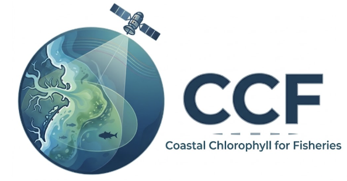

**POC:** [Ryan Vandermeulen](Ryan.Vandermeulen@noaa.gov) & [Kim Hyde](kimberly.hyde@noaa.gov)

Coastal waters are among the most biologically productive and fisheries-important regions of the ocean, yet they are also among the most difficult environments for satellite ocean-color algorithms to characterize. Complex optical conditions can make it difficult to distinguish the chlorophyll signal from other sources of ocean color, limiting the accuracy of remotely sensed chlorophyll in precisely the regions where fisheries science needs it most. The Coastal Chlorophyll for Fisheries (CCF) project is establishing the foundation for a next-generation capability to observe these waters at the spatial and temporal scales needed for fisheries science.

Through a linked NESDIS-PPM project, NASA Goddard developed the **Ocean Color Radiometry Band Shifted (OCRBS)** data record specifically for NMFS. OCRBS brings together multiple satellite sensors into a consistent, long-term, high-resolution record of ocean color reflectance and chlorophyll-a, providing a foundation for the coastal ocean observations that fisheries science has long needed. The product provides global coverage at 1.2 km resolution, 16 times finer than current operational products used by NMFS, with near-real-time updates extending a historical record of roughly three decades. This combination of spatial detail, temporal continuity, and multi-sensor consistency provides a much stronger foundation for understanding and monitoring biologically important coastal waters.

CCF is also building the observations needed to make those satellite measurements more reliable. The [**Coastal North America In Situ Chlorophyll and Optical Dataset**](http://doi.org/10.5281/zenodo.20140178) contains more than 700,000 quality-controlled chlorophyll observations, along with associated CDOM and remote sensing reflectance measurements where available. These observations are being used to evaluate OCRBS and develop improved coastal chlorophyll algorithms, providing an unprecedented resource for connecting what satellites see with what is actually occurring in the water. Improved coastal observations will also support tuning and validation of MOM-6, a fisheries-specific biogeochemical model being used to inform fisheries forecasts. By improving our ability to observe the biological environment and represent it in models, CCF helps connect satellite observations to the ecosystem processes that influence fisheries.

