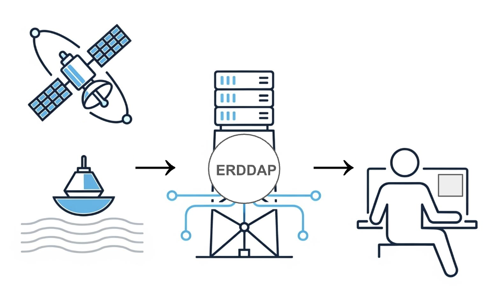

ERDDAP™ is a robust, free, and open-source data server designed to make complex scientific data easier to find, access, and integrate. Originally developed at the Southwest Fisheries Science Center (SWFSC) in 2007, ERDDAP™ has grown into an essential data distribution backbone utilized across all NOAA line offices and by over 100 organizations worldwide.

ERDDAP™ bridges the gap between humans and machines by offering intuitive web pages for data browsing and visualization, alongside standardized web services for programmatic access via R, Python, MATLAB, and modern AI/ML frameworks using Model Context Protocol (MCP). By standardizing diverse environmental data—including satellite observations, in-situ ocean measurements, fisheries data, and atmospheric models—into a unified interface, ERDDAP™ drastically reduces data-wrangling time and fully supports FAIR (Findable, Accessible, Interoperable, and Reusable) data principles.

Despite its widespread adoption and significant productivity savings for researchers, ERDDAP™ has historically relied on sporadic funding and part-time developer support, creating single-point-of-failure risks. The objective of this SI project is to develop a strategy to secure permanent enterprise funding and establish a dedicated operational team. Key objectives include expanding core software maintenance, supporting cloud migration to the Google Cloud Platform (GCP) to meet Department of Commerce mandates, and scaling technical and community support.

Securing stable operational backing will ensure ERDDAP™ remains a secure, scalable, and continuously updated asset, empowering open science and efficient environmental decision-making globally.

 
[**ERDDAP Page**](https://erddap.github.io/)

[**Cloud ERDDAP Set-Up Instructions**](https://erd-coastwatch.github.io/swfsc-gcp-migration/)
