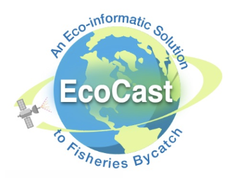
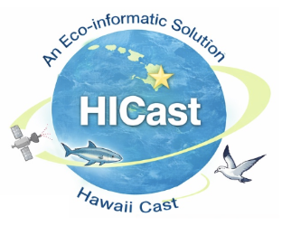
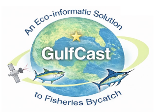

::: {layout-ncol=3}

:::

**POCs:** [John Quinlan](john.a.quinlan@noaa.gov), [Ryan Rykaczewski](ryan.rykaczewski@noaa.gov), & [Michael Jacox](Michael.Jacox@noaa.gov)

**Project page:** https://ecocast-plus.github.io/operationalization/

EcoCast+ is a suite of advanced dynamic ocean management tools designed to support sustainable fisheries and protect vulnerable marine life. Building upon the proven success of the original West Coast EcoCast system, EcoCast+ is expanding  tools to the other FMC regions. All EcoCast+ tools integrate near-real-time oceanographic data—such as sea surface temperature, sea height anomalies, and chlorophyll-a observations—with biological observations to predict species distributions in dynamic marine environments.

EcoCast+ provides actionable guidance to commercial fishing fleets and fisheries managers, helping them optimize target species catch while significantly minimizing the risk of bycatch for protected species like sea turtles, marine mammals, and non-target sharks. By replacing static seasonal closures and historical averages with dynamic, data-driven insights, EcoCast+ balances economic efficiency with rigorous conservation compliance in support of the Magnuson-Stevens Act, Marine Mammal Protection Act, and Endangered Species Act.

Originally developed for the West Coast fishery for highly migratory species, EcoCast+ is expanding to support additional regions, including the central North Pacific (Hawaii-based longline fisheries), the Gulf of America, and emerging applications across the Northwest, Northeast, and Alaska Fisheries Science Centers. Operating in close partnership with regional fishery management councils and NOAA Fisheries, EcoCast+ leverages cloud-based infrastructure and automated daily-to-bi-weekly map generation to deliver timely decision-support tools. Ultimately, EcoCast+ serves as a scalable, cost-effective solution advancing NOAA's mission of ecosystem-based management and long-term marine conservation.
