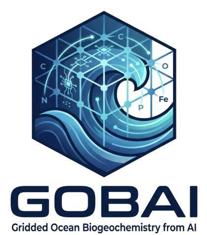

**POCs:** [Ryan Rykaczewski](ryan.rykaczewski@noaa.gov) & [Andrea Fassbender](andrea.fassbender@noaa.gov)

**Project website:** [https://www.pmel.noaa.gov/gobai/](https://www.pmel.noaa.gov/gobai/)

Understanding changes in essential subsurface ocean properties—such as temperature, salinity, and biogeochemical parameters—is fundamental to managing marine resources, predicting ecosystem shifts, and supporting sustainable fisheries. Historically, four-dimensional observational constraints on these subsurface variables were limited to static climatologies like the World Ocean Atlas. While the global array of profiling floats (Argo and BGC-Argo) has significantly expanded subsurface sampling, these observations remain spatially and temporally sparse. To address this gap, the Gridded Ocean  Biogeochemistry from AI (GOBAI) project at PMEL leverages advanced artificial intelligence and machine learning techniques to combine satellite sea-surface temperature and sea-surface height measurements with in-situ float data. This approach generates near-global, gap-filled, three-dimensional gridded ocean products for temperature, salinity, and dissolved oxygen concentration at a seven-day temporal resolution and 0.25° spatial grid spanning 1993 to the present across the upper 2,000 meters of the water column. Supported by the Remote Sensing Strategic Initiative, GOBAI has expanded its capability to include gridded estimates of ocean nitrate and particulate organic carbon. By delivering dynamic, near-real-time environmental context to scientists, resource managers, and decision-makers, GOBAI products will enable actionable responses to marine heatwaves, climate oscillations, and long-term oceanographic shifts.
