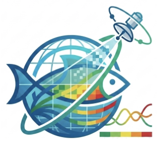

**POC:** [Cara Wilson](https://www.fisheries.noaa.gov/contact/cara-wilson-phd) 

[**See Coastal Chlorophyll for Fisheries**](CoastalChl.qmd)

The Satellite Ecosystem Assessment for NOAA Fisheries (SEA-Fish) project was conceived at the National Ecosystem Assessment Program (NEAP) workshop in May 2026. While satellite data offer vast global coverage and multi-decade time series essential for monitoring oceanic ecosystems, standard satellite products often lack actionable context for local resource managers. Without long-term baselines or climatologies calculated across decades, individual oceanographic measurements—such as sea surface temperature or chlorophyll levels—provide limited insight. Furthermore, critical ecological statistics like phytoplankton bloom timing and duration are difficult for non-specialized users to calculate.

To address these issues, SEA-Fish will create an interactive dashboard to visualize yearly regional satellite based assessment reports that will include long-term trends,  anomalies and other relevant indicators generated using consistent methods. While there are numerous satellite products to choose from, this tool will offer a curated list tailored specifically to the NEAP community focused on ecosystem assessment. The tool will also deliver regional custom-derived products, including primary productivity, marine heatwaves, harmful algal blooms, and physical indicators. The initiative's initial milestone wil focus on developing a chlorophyll climatology using the OCRBS product (see Coastal Chlorophyll for Fisheries project) to produce standardized anomaly maps. SEA-Fish is currently funded by CoastWatch through its support of the CoastWatch West Coast Node.

