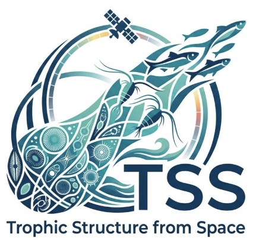

**POC:** [Ryan Vandermeulen](https://www.fisheries.noaa.gov/contact/ryan-vandermeulen)

The Trophic Structure from Space (TSS) project is developing an integrated observing capability to better characterize lower trophic-level dynamics and their role in marine ecosystems. Across NOAA Fisheries, we lack a systematic approach for observing these dynamics, despite their fundamental importance to understanding how energy moves through marine food webs. Plankton form the base of that system, and changes in their abundance, community composition, size structure, and bloom timing can influence how energy is transferred to higher trophic levels and ultimately affect the distribution and productivity of fish.

The TSS pairs hyperspectral, ship-based radiometry from the Dynamic Above-water Radiance (L) and Irradiance (E) Collector (DALEC) with automated plankton imaging from Imaging FlowCytobots (IFCBs) and other complementary observations. Together, these technologies provide coordinated measurements of the optical and biological characteristics of the lower trophic levels needed to develop and evaluate ecosystem models and indicators. The project is also exploring how these observations can be linked to juvenile fish dynamics, providing a direct connection between lower trophic-level conditions and fisheries-relevant processes.

A central goal is to develop relationships that connect readily measurable ocean properties with biologically meaningful characteristics of plankton communities. Once developed and tested, these relationships can be applied to freely available satellite observations, allowing lower trophic-level information to be extended across spatial and temporal scales that cannot be achieved through ship- or platform-based observations alone.

The project has already produced broader community benefits. NOAA Fisheries supported CoastWatch in incorporating DALEC processing modules into HyperCP, a fiducial reference-compliant community processor developed by NASA. The resulting capability is now available to scientists worldwide and is being used in satellite validation activities. TSS builds on this foundation to develop a more comprehensive, scalable approach for incorporating lower trophic-level dynamics into ecosystem science and fisheries applications.

