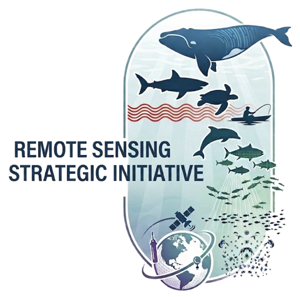

**Overall SI Goal:** Improve the accessibility and use of remote sensing data by NOAA Fisheries in support of ecosystem-based fisheries management.

:::: {.grid .project-row}

::: {.g-col-3 .text-center}

:::

::: {.g-col-9 .project-text}
NOAA's marine stewardship mission requires continuous, broad-scale observation of ocean dynamics, ecosystem health, and protected species. The Remote Sensing Strategic Initiative (SI) addresses critical observational gaps by integrating satellite oceanography, autonomous platforms, artificial intelligence (AI), and cloud data infrastructure. Projects within the SI enhance NOAA's capabilities to monitor and model marine ecosystems, support sustainable fisheries management, reduce protected species bycatch, and enable climate-ready decision-making across U.S. coastal and ocean waters. These efforts directly align with key NOAA Fisheries Multi-Annual Priority Strategies (MAPS), including modernizing data collection and assessments, prioritizing key species, conserving fish habitat, implementing cloud services, and enhancing digital services and open data systems.
:::

::::